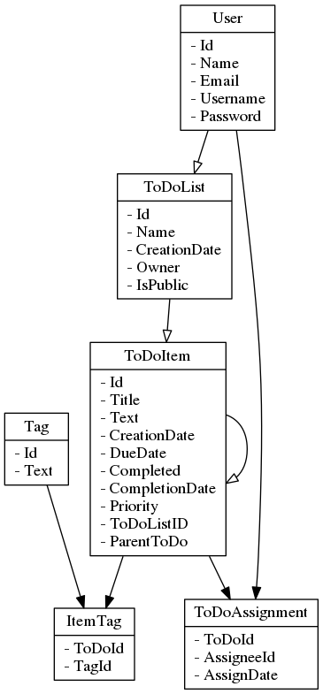

#A2
##5

SELECT VERSION();

```
mysql> SELECT VERSION();
+-----------+
| VERSION() |
+-----------+
| 5.7.16    |
+-----------+
1 row in set (0,00 sec)
```

SELECT now();

```
mysql> SELECT now();
+---------------------+
| now()               |
+---------------------+
| 2016-11-23 16:11:49 |
+---------------------+
1 row in set (0,00 sec)
```
HELP

```
mysql> HELP

For information about MySQL products and services, visit:
   http://www.mysql.com/
For developer information, including the MySQL Reference Manual, visit:
   http://dev.mysql.com/
To buy MySQL Enterprise support, training, or other products, visit:
   https://shop.mysql.com/

List of all MySQL commands:
Note that all text commands must be first on line and end with ';'
?         (\?) Synonym for `help'.
clear     (\c) Clear the current input statement.
connect   (\r) Reconnect to the server. Optional arguments are db and host.
delimiter (\d) Set statement delimiter.
edit      (\e) Edit command with $EDITOR.
ego       (\G) Send command to mysql server, display result vertically.
exit      (\q) Exit mysql. Same as quit.
go        (\g) Send command to mysql server.
help      (\h) Display this help.
nopager   (\n) Disable pager, print to stdout.
notee     (\t) Don't write into outfile.
pager     (\P) Set PAGER [to_pager]. Print the query results via PAGER.
print     (\p) Print current command.
prompt    (\R) Change your mysql prompt.
quit      (\q) Quit mysql.
rehash    (\#) Rebuild completion hash.
source    (\.) Execute an SQL script file. Takes a file name as an argument.
status    (\s) Get status information from the server.
system    (\!) Execute a system shell command.
tee       (\T) Set outfile [to_outfile]. Append everything into given outfile.
use       (\u) Use another database. Takes database name as argument.
charset   (\C) Switch to another charset. Might be needed for processing binlog with multi-byte charsets.
warnings  (\W) Show warnings after every statement.
nowarning (\w) Don't show warnings after every statement.
resetconnection(\x) Clean session context.

For server side help, type 'help contents'
```
HELP Contents

```
mysql> HELP Contents
You asked for help about help category: "Contents"
For more information, type 'help <item>', where <item> is one of the following
categories:
   Account Management
   Administration
   Compound Statements
   Data Definition
   Data Manipulation
   Data Types
   Functions
   Functions and Modifiers for Use with GROUP BY
   Geographic Features
   Help Metadata
   Language Structure
   Plugins
   Procedures
   Storage Engines
   Table Maintenance
   Transactions
   User-Defined Functions
   Utility

```

HELP Data Manipulation

```
mysql> HELP Data Manipulation
You asked for help about help category: "Data Manipulation"
For more information, type 'help <item>', where <item> is one of the following
topics:
   CALL
   DELETE
   DO
   DUAL
   HANDLER
   INSERT
   INSERT DELAYED
   INSERT SELECT
   JOIN
   LOAD DATA
   LOAD XML
   REPLACE
   SELECT
   UNION
   UPDATE

```


HELP SHOW DATABASES

```
mysql> HELP SHOW DATABASES
Name: 'SHOW DATABASES'
Description:
Syntax:
SHOW {DATABASES | SCHEMAS}
    [LIKE 'pattern' | WHERE expr]

SHOW DATABASES lists the databases on the MySQL server host. SHOW
SCHEMAS is a synonym for SHOW DATABASES. The LIKE clause, if present,
indicates which database names to match. The WHERE clause can be given
to select rows using more general conditions, as discussed in
http://dev.mysql.com/doc/refman/5.7/en/extended-show.html.

You see only those databases for which you have some kind of privilege,
unless you have the global SHOW DATABASES privilege. You can also get
this list using the mysqlshow command.

If the server was started with the --skip-show-database option, you
cannot use this statement at all unless you have the SHOW DATABASES
privilege.

URL: http://dev.mysql.com/doc/refman/5.7/en/show-databases.html


```

##6
tes



